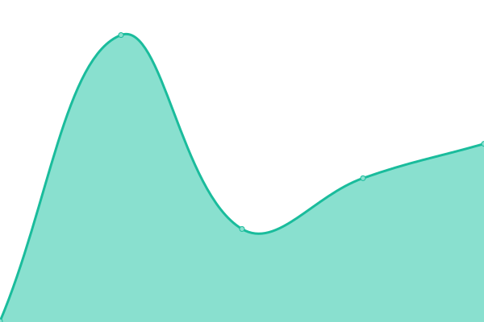

# [📈 Live Status](https://CoreMedia.github.io/campaign.upptime): <!--live status--> **🟧 Partial outage**

This repository contains the open-source uptime monitor and status page for [CoreMedia](http://www.coremedia.com), powered by [Upptime](https://github.com/upptime/upptime).

With [Upptime](https://upptime.js.org), you can get your own unlimited and free uptime monitor and status page, powered entirely by a GitHub repository. We use [Issues](https://github.com/CoreMedia/campaign.upptime/issues) as incident reports, [Actions](https://github.com/CoreMedia/campaign.upptime/actions) as uptime monitors, and [Pages](https://CoreMedia.github.io/campaign.upptime) for the status page.

<!--start: status pages-->
<!-- This summary is generated by Upptime (https://github.com/upptime/upptime) -->
<!-- Do not edit this manually, your changes will be overwritten -->
<!-- prettier-ignore -->
| URL | Status | History | Response Time | Uptime |
| --- | ------ | ------- | ------------- | ------ |
|  [Google](https://www.google.com) | 🟩 Up | [google.yml](https://github.com/CoreMedia/campaign.upptime/commits/HEAD/history/google.yml) | 

 81ms
     
 | 

<a href="https://CoreMedia.github.io/campaign.upptime/history/google">100.00%</a>
    

|  [Wikipedia](https://en.wikipedia.org) | 🟩 Up | [wikipedia.yml](https://github.com/CoreMedia/campaign.upptime/commits/HEAD/history/wikipedia.yml) | 

 362ms
     
 | 

<a href="https://CoreMedia.github.io/campaign.upptime/history/wikipedia">100.00%</a>
    

|  [Campaign Service Production](https://api.campaigns.coremedia.io) | 🟩 Up | [campaign-service-production.yml](https://github.com/CoreMedia/campaign.upptime/commits/HEAD/history/campaign-service-production.yml) | 

 245ms
     
 | 

<a href="https://CoreMedia.github.io/campaign.upptime/history/campaign-service-production">100.00%</a>
    

|  [Campaign Service Development](https://campaigns-dev.stellate.sh/) | 🟩 Up | [campaign-service-development.yml](https://github.com/CoreMedia/campaign.upptime/commits/HEAD/history/campaign-service-development.yml) | 

 400ms
     
 | 

<a href="https://CoreMedia.github.io/campaign.upptime/history/campaign-service-development">100.00%</a>
    

|  [Test Broken Site](https://thissitedoesnotexist.koj.co) | 🟥 Down | [test-broken-site.yml](https://github.com/CoreMedia/campaign.upptime/commits/HEAD/history/test-broken-site.yml) | 

 0ms
     
 | 

<a href="https://CoreMedia.github.io/campaign.upptime/history/test-broken-site">100.00%</a>
    

<!--end: status pages-->

[**Visit our status website →**](https://CoreMedia.github.io/campaign.upptime)

## 📄 License

- Powered by: [Upptime](https://github.com/upptime/upptime)
- Code: [MIT](./LICENSE) © [CoreMedia](http://www.coremedia.com)
- Data in the `./history` directory: [Open Database License](https://opendatacommons.org/licenses/odbl/1-0/)
