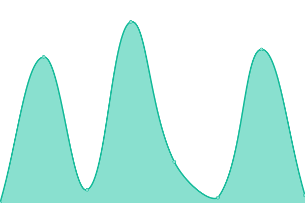

# [📈 Live Status](https://CoreMedia.github.io/campaign.upptime): <!--live status--> **🟩 All systems operational**

This repository contains the open-source uptime monitor and status page for [CoreMedia](http://www.coremedia.com), powered by [Upptime](https://github.com/upptime/upptime).

With [Upptime](https://upptime.js.org), you can get your own unlimited and free uptime monitor and status page, powered entirely by a GitHub repository. We use [Issues](https://github.com/CoreMedia/campaign.upptime/issues) as incident reports, [Actions](https://github.com/CoreMedia/campaign.upptime/actions) as uptime monitors, and [Pages](https://CoreMedia.github.io/campaign.upptime) for the status page.

<!--start: status pages-->
<!-- This summary is generated by Upptime (https://github.com/upptime/upptime) -->
<!-- Do not edit this manually, your changes will be overwritten -->
<!-- prettier-ignore -->
| URL | Status | History | Response Time | Uptime |
| --- | ------ | ------- | ------------- | ------ |
|  [Delivery API](https://api.campaigns.coremedia.io) | 🟩 Up | [delivery-api.yml](https://github.com/CoreMedia/campaign.upptime/commits/HEAD/history/delivery-api.yml) | 

 496ms
     
 | 

<a href="https://status.campaigns.coremedia.io/history/delivery-api">100.00%</a>
    

|  [Management API](https://prod.campaign-management-prod.coremedia.services/graphql) | 🟩 Up | [management-api.yml](https://github.com/CoreMedia/campaign.upptime/commits/HEAD/history/management-api.yml) | 

 642ms
     
 | 

<a href="https://status.campaigns.coremedia.io/history/management-api">100.00%</a>
    

|  [Authorization API](https://coremedia-jwt.api.coremedia.services/v1/config) | 🟩 Up | [authorization-api.yml](https://github.com/CoreMedia/campaign.upptime/commits/HEAD/history/authorization-api.yml) | 

 570ms
     
 | 

<a href="https://status.campaigns.coremedia.io/history/authorization-api">100.00%</a>
    

<!--end: status pages-->

[**Visit our status website →**](https://CoreMedia.github.io/campaign.upptime)

## 📄 License

- Powered by: [Upptime](https://github.com/upptime/upptime)
- Code: [MIT](./LICENSE) © [CoreMedia](http://www.coremedia.com)
- Data in the `./history` directory: [Open Database License](https://opendatacommons.org/licenses/odbl/1-0/)
